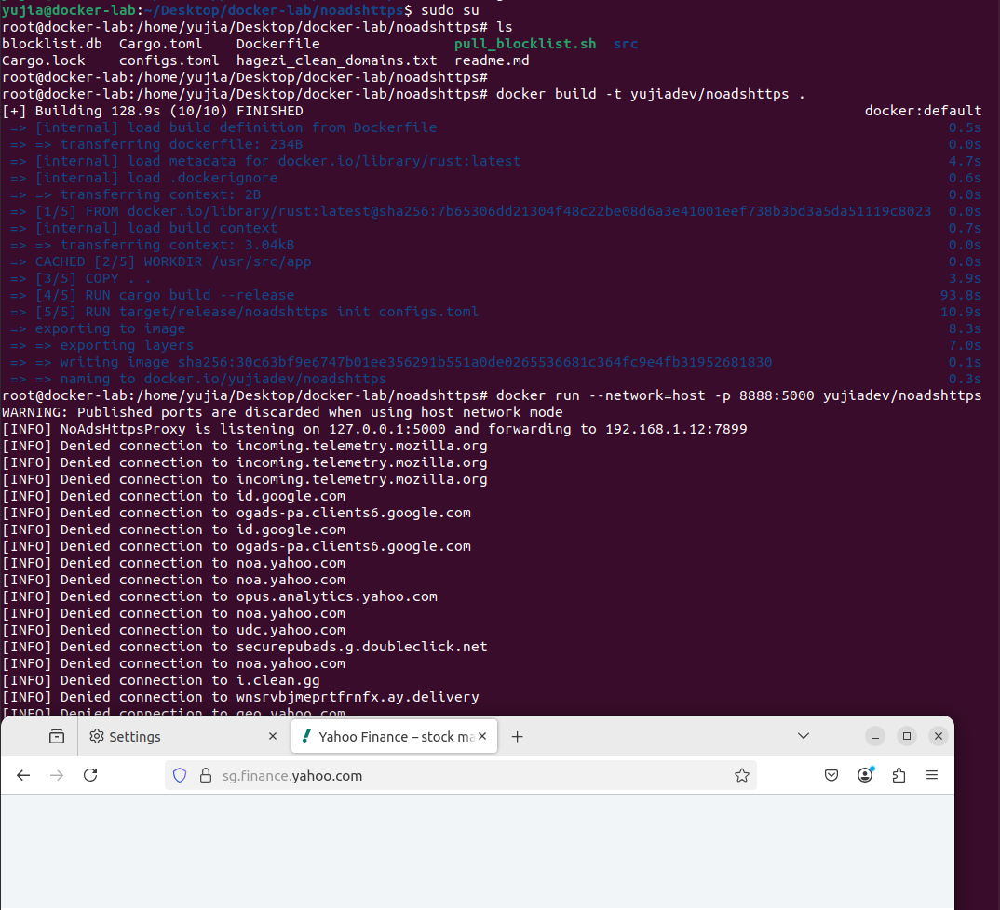

# NoAdsHttps

A HTTPs proxy that filters web advertisements on HTTP level.

### If you want to compile the source code into executable yourself (Recommended)
1. Setup Rust compiler and cargo package manager. (https://www.rust-lang.org/tools/install)
2. git clone the repository (git clone https://github.com/yujiadev/noadshttps.git)
3. Change directory the noadshttps, then compile the source code with the following command 

```bash
cargo build --release
```
4. Now the compiled binary should reside under the path target/release/noadshttps
5. Next setup the configuration file. The parameter of the configurations are address, x_forward_address, database_uri, and blocklist.


| Parameters        | Purpose                                                   |
| ----------------- | --------------------------------------------------------- |
| address           | binding address of HTTPS proxy, default is 127.0.0.1:5000 |
| x_forward_address | forward address of network traffic, if another HTTPS proxy needs (like clash), it can be set to the HTTPS proxy address on clash, if set to the same address as "address", then no forwarding will done |
| databased_uri    | Path to the SQLite database    |
| blocklist        | Path to a text file that contains a list of web advertisements domains |

```toml
# Forward to another HTTPS proxy
address = "127.0.0.1:5000"					# Local binding address
x_forward_address = "192.168.1.12:7899"     # Clash HTTPS proxy listening address which traffic forward to
database_uri = "blocklist.db"				# Local SQLite database location
blocklist = "hagezi_clean_domains.txt"		# A text file contains a list of advertisement domains
```

```toml
# No forwarding just filtering 
address = "127.0.0.1:5000"					# Local binding address
x_forward_address = "127.0.0.1:5000"        # Same as local binding address, no forwarding
database_uri = "blocklist.db"				# Local SQLite database location
blocklist = "hagezi_clean_domains.txt"		# A text file contains a list of advertisement domains
```

6. Build the blocklist.db
Bash
```bash
target/release/noadshttps init configs.toml
```
PowerShell/CMD
```cmd
target/release/noadshttps.exe init configs.toml
```
7. Run the NoAdsHttps proxy
Bash
```bash
./noadshttps run configs.toml
```
PowerShell/CMD
```cmd
.\noadshttps.exe run configs.toml
```
Output
```bash
yujia@workstation:~/Desktop/rust-labs/noadshttps$ target/release/noadshttps run configs.toml
[INFO] NoAdsHttpsProxy is listening on 127.0.0.1:5000 and forwarding to 192.168.1.12:7899
[INFO] Denied connection to id.google.com
[INFO] Denied connection to ogads-pa.clients6.google.com
[INFO] Denied connection to googleads.g.doubleclick.net
[INFO] Denied connection to static.doubleclick.net
[INFO] Denied connection to googleads.g.doubleclick.net
[INFO] Denied connection to id.google.com
[INFO] Denied connection to ogads-pa.clients6.google.com
[INFO] Denied connection to googleads.g.doubleclick.net
[INFO] Denied connection to static.doubleclick.net
[INFO] Denied connection to w3-reporting.reddit.com
[INFO] Denied connection to w3-reporting.reddit.com
[INFO] Denied connection to error-tracking.reddit.com
[INFO] Denied connection to id.rlcdn.com
```

### If you want to use pre-compiled version
1. Go the the GitHub project release page, download the zip.
2. Unzipped the downloaded compressed file.
3. Setup the configs.toml to your liking.
4. Build "blocklist.db" with the following command 
```bash
$ target/release/noadshttps init configs.toml
```

```cmd
target/release/noadshttps.exe init configs.toml
```

5. Run the NoAdsHttps proxy
Bash
```bash
./noadshttps run configs.toml
```
PowerShell/CMD
```cmd
.\noadshttps.exe run configs.toml
```

Output
```bash
yujia@workstation:~/Desktop/rust-labs/noadshttps$ target/release/noadshttps run configs.toml
[INFO] NoAdsHttpsProxy is listening on 127.0.0.1:5000 and forwarding to 192.168.1.12:7899
[INFO] Denied connection to id.google.com
[INFO] Denied connection to ogads-pa.clients6.google.com
[INFO] Denied connection to googleads.g.doubleclick.net
[INFO] Denied connection to static.doubleclick.net
[INFO] Denied connection to googleads.g.doubleclick.net
[INFO] Denied connection to id.google.com
[INFO] Denied connection to ogads-pa.clients6.google.com
[INFO] Denied connection to googleads.g.doubleclick.net
[INFO] Denied connection to static.doubleclick.net
[INFO] Denied connection to w3-reporting.reddit.com
[INFO] Denied connection to w3-reporting.reddit.com
[INFO] Denied connection to error-tracking.reddit.com
[INFO] Denied connection to id.rlcdn.com
```

### If you want to host the proxy in Docker
Running a docker container there are a few things need to consider. The network configurations tightly depend on how forward service setup. It is more a docker topic than a NoAdsHttps proxy setup topic. Assume you have the same network topology  as mine.

client and docker on machine A <-----> Clash Verge machine B <-----> Router <-----> Internet

The following docker build command can be used.

```bash
docker build -t yujiadev/noadshttps .
```



